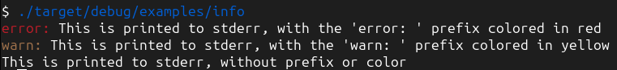
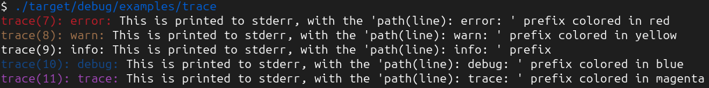
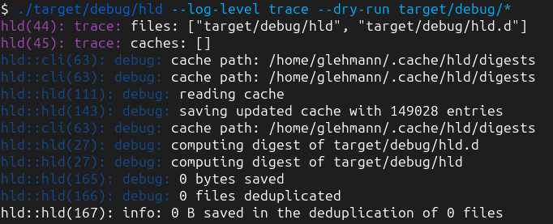

# ocli

A simple, opinionated logger for command line tools

`ocli` aims at a very simple thing: logging for CLI tools done right. It uses the
`log` crate and the `ansi_term` crate for colors. It provides very few configuration —
at this time, just the expected log level.

## Features

### logs everything to `stderr`

CLI tools are expected to be usable in a pipe. In that context,
the messages addressed to the user must be written on `stderr` to have a chance to be read
by the user, independently of the log level.
The program outputs that are meant to be used with a pipe shouldn't go through the logging
system, but instead be printed to `stdout`, for example with `println!`.

### shows the `Info` message as plain uncolored text

`Info` is expected to be the normal log
level to display messages that are not highlighting a problem and that are not too verbose
for a standard usage of the tool. Because it is intended for messages that are related
to a normal situation, the messages of that level are not prefixed with the log level.

### prefix the messages with their colored log level for any level other than `Info`

The color depends on the log level, allowing to quickly locate a message at a specific log level

### displays the module path and line when configured at the `Trace` log level

for all the
messages, even if they are not at the `Trace` log level. The `Trace` log level is used
to help the developer understand where a message comes from, in addition to display a larger
amount of messages.

### disables all colorization in case the `stderr` is not a tty, and adheres to `NO_COLOR` and `FORCE_COLOR`

so the output is not polluted with unreadable characters when `stderr` is redirected to a file.
This crates disables colorization when the `NO_COLOR` environment is set, and force it when `FORCE_COLOR` is set.
The colorization is disabled when both environment variables are set.

## Example with `Info` log level

```rust
#[macro_use] extern crate log;

fn main() {
     ocli::init(log::Level::Info).unwrap();

     error!("This is printed to stderr, with the 'error: ' prefix colored in red");
     warn!("This is printed to stderr, with the 'warn: ' prefix colored in yellow");
     info!("This is printed to stderr, without prefix or color");
     debug!("This is not printed");
     trace!("This is not printed");
}
```


## Example with `Trace` log level

```rust
#[macro_use] extern crate log;

fn main() {
     ocli::init(log::Level::Trace).unwrap();

     error!("This is printed to stderr, with the 'path(line): error: ' prefix colored in red");
     warn!("This is printed to stderr, with the 'path(line): warn: ' prefix colored in yellow");
     info!("This is printed to stderr, with the 'path(line): info: ' prefix");
     debug!("This is printed to stderr, with the 'path(line): debug: ' prefix colored in blue");
     trace!("This is printed to stderr, with the 'path(line): trace: ' prefix colored in magenta");
}
```



and a more realistic example with [hld](https://github.com/glehmann/hld):



## Example with clap integration

The log level can be configured with a command line argument, using the `clap` crate.
Try running it with `cargo run --example cli -- --log-level trace` and change the log level
to see the difference.

```rust
#[macro_use]
extern crate log;

use clap::Parser;

/// A demo of ocli with clap
#[derive(Parser, Debug)]
#[command(author, version, about, long_about = None)]
pub struct Config {
    /// Log level
    #[arg(short, long, default_value_t = log::Level::Info)]
    pub log_level: log::Level,
}

fn main() {
    let config = Config::parse();
    ocli::init(config.log_level).unwrap();

    println!("this is on stdout — try to pipe it to another command like `grep` or `wc`");
    error!("log at error level on stderr");
    warn!("log at warn level on stderr");
    info!("log at info level on stderr");
    debug!("log at debug level on stderr");
    trace!("log at trace level on stderr");
    info!("the logs at any level are meant to inform the user");
    info!("while still being able to pipe stdout");
}
```

## Example with clap-verbosity-flag integration

The log level can be configured with a command line argument, using the `clap-verbosity-flag` crate.
Try running it with `cargo run --example verbosity -- -vv` or `cargo run --example verbosity -- -q`.
Changing the number of `-v` or `-q` changes the log level.

```rust
#[macro_use]
extern crate log;

use clap::Parser;
use clap_verbosity_flag::{InfoLevel, Verbosity};

/// A demo of ocli with clap
#[derive(Parser, Debug)]
#[command(author, version, about, long_about = None)]
pub struct Config {
    /// Log level
    #[command(flatten)]
    pub verbose: Verbosity<InfoLevel>,
}

fn main() {
    let config = Config::parse();
    if let Some(level) = config.verbose.log_level() {
        ocli::init(level).unwrap();
    }
    println!("this is on stdout — try to pipe it to another command like `grep` or `wc`");
    error!("log at error level on stderr");
    warn!("log at warn level on stderr");
    info!("log at info level on stderr");
    debug!("log at debug level on stderr");
    trace!("log at trace level on stderr");
    info!("the logs at any level are meant to inform the user");
    info!("while still being able to pipe stdout");
}
```

## License

`ocli` is distributed under the terms of the MIT license.

See [LICENSE](LICENSE) for details.
